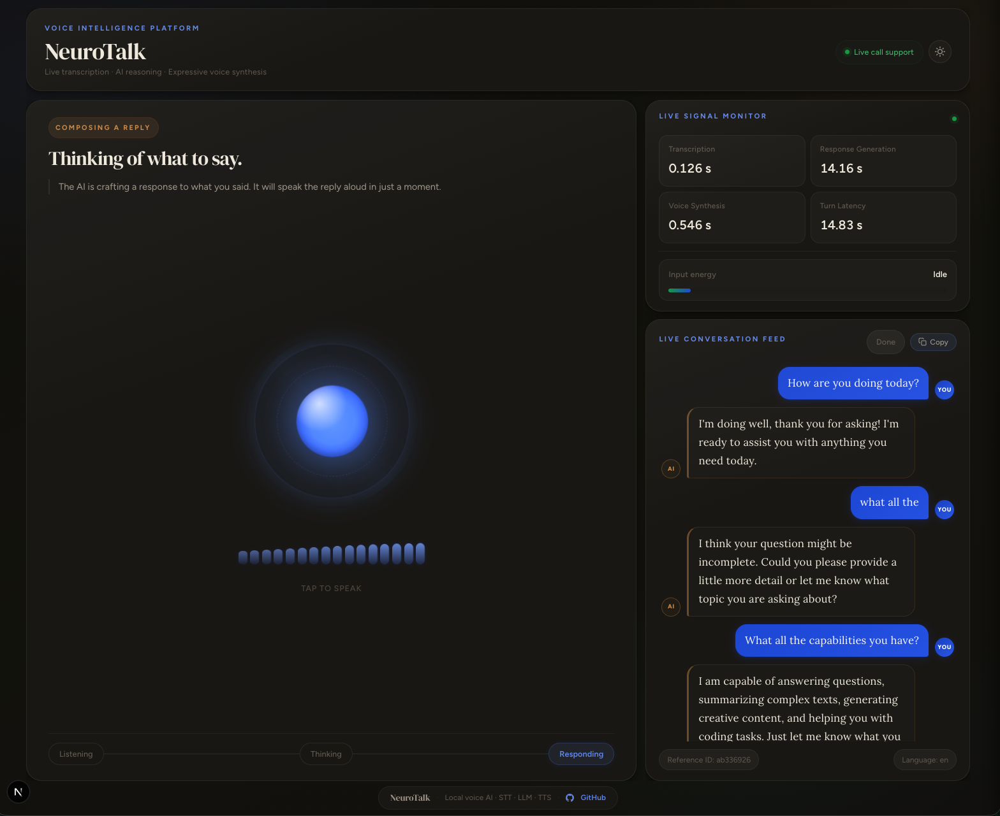

# NeuroTalk

Real-time voice agent console — live speech transcription with AI-assisted responses and interrupt handling.



## Demo

https://github.com/nitishkmr005/neuroTalk/raw/main/docs/NeuroTalk_Social_Media_V2.mp4

In the preview above, `Response Generation: 14.16 s` reflects the time the LLM spends generating the reply token by token in real time.
Because text streaming and voice streaming are synchronized, TTS starts speaking as tokens arrive, so playback overlaps with generation instead of waiting for the full response.

Designed for two contexts: **customer-facing** (direct query answering) and **associate-facing** (live call assist with database/article lookup). A voice response layer with emotional expressiveness is on the roadmap.

## Stack

| Layer | Tech |
|-------|------|
| Frontend | Next.js 15 · TypeScript · Lora + DM Serif Display fonts |
| Backend | FastAPI · Python 3.11+ · uv |
| Transport (audio in) | **WebRTC / RTP** (Opus codec, `aiortc` + `PyAV`) · WebSocket PCM streaming |
| Transport (agent out) | **RTCDataChannel** (ordered JSON) · WebSocket JSON |
| STT | faster-whisper (`small`, int8, CPU) — via CTranslate2 |
| LLM | Ollama (local) — `llama3.2:3b` (default) |
| TTS | Kokoro 82M MLX (default) · Chatterbox Turbo · Qwen · VibeVoice |
| Server-side VAD | Energy RMS on decoded Opus frames (aiortc/av pipeline) |
| ICE / NAT traversal | STUN (`stun.l.google.com:19302`) · Vanilla ICE (full gather before offer) |
| Config | Pydantic Settings + `.env` |
| Logging | Loguru — colorful terminal + rotating JSON files |

## Quick Start

```bash
# 1. Install system dependency (macOS — required by aiortc for SRTP)
brew install libsrtp

# 2. Install project dependencies
make setup

# 3. Set up Ollama (LLM — local, no API key)
brew install ollama
ollama pull llama3.2:3b
ollama serve          # runs at http://localhost:11434

# 4. Run both services
make dev
# Frontend → http://localhost:3000
# Backend  → http://localhost:8000
```

> **Linux:** replace `brew install libsrtp` with `apt-get install libsrtp2-dev` (Debian/Ubuntu).

## Transports

NeuroTalk supports two transport modes selectable in the UI:

| Mode | Audio path | Signalling |
|------|-----------|------------|
| **WebRTC** (default) | Browser mic → Opus RTP → UDP → aiortc → PCM 16kHz | RTCDataChannel (JSON) |
| **WebSocket** | Browser mic → Float32 PCM → WebSocket binary frames | Same WebSocket (JSON) |

WebRTC is recommended: browser-native echo cancellation, noise suppression, and auto-gain control are applied before encoding. The data channel carries the same JSON protocol as the WebSocket path, so the frontend message handler is shared between both modes.

## Environment Variables

Copy `backend/.env.example` → `backend/.env` and adjust as needed.

| Variable | Default | Description |
|----------|---------|-------------|
| `STT_MODEL_SIZE` | `small` | Whisper model (`tiny.en` → `large-v3`) |
| `STT_DEVICE` | `cpu` | `cpu` or `cuda` |
| `OLLAMA_HOST` | `http://localhost:11434` | Ollama server URL |
| `LLM_MODEL` | `llama3.2:3b` | Any model pulled via `ollama pull` |
| `LLM_MAX_TOKENS` | `100` | Max tokens per LLM response |
| `LLM_MAX_HISTORY_TURNS` | `6` | Conversation turns kept in context |
| `TTS_BACKEND` | `kokoro` | TTS engine — see below |
| `STREAM_EMIT_INTERVAL_MS` | `250` | Minimum gap between partial STT emits |
| `STREAM_MIN_AUDIO_MS` | `300` | Minimum buffered audio before STT runs |
| `STREAM_LLM_SILENCE_MS` | `350` | Silence window before triggering the LLM |

## Switching LLM Models

NeuroTalk uses Ollama for local LLM inference. Switching models is one line.

**Available models (fast → quality):**

| Model | `LLM_MODEL` value | Notes |
|-------|-------------------|-------|
| Llama 3.2 3B | `llama3.2:3b` | **Default.** Fast, low RAM (~2 GB). |
| Qwen3 4B | `qwen3:4b` | Fast, strong tool-calling (~3 GB). |
| Gemma 3 1B | `gemma3:1b` | Fastest, minimal memory (~1 GB). |
| Gemma 3 4B | `gemma3:4b` | Better quality (~3 GB RAM). |
| Llama 3.2 1B | `llama3.2:1b` | Similar speed to gemma3:1b. |
| Mistral 7B | `mistral` | Strong general model. |

```bash
# 1. Pull the model
ollama pull qwen3:4b

# 2. Set in backend/.env
LLM_MODEL=qwen3:4b

# 3. Restart backend
make backend
```

One-liner (no .env edit):
```bash
LLM_MODEL=qwen3:4b make backend
```

> To use a non-Ollama provider (OpenAI, Anthropic, etc.), update `backend/app/services/llm.py` to call the respective SDK instead of the Ollama client.

---

## Switching STT Models

NeuroTalk uses `faster-whisper` for speech recognition.

**Whisper model sizes:**

| `STT_MODEL_SIZE` | Speed | Accuracy | RAM |
|------------------|-------|----------|-----|
| `tiny.en` | ~4× faster | Lower | ~200 MB |
| `small.en` | **Default** | Good | ~500 MB |
| `medium.en` | Slower | Better | ~1.5 GB |
| `large-v3` | Slowest | Best | ~3 GB |

```bash
# Set in backend/.env
STT_MODEL_SIZE=tiny.en   # for speed
STT_MODEL_SIZE=large-v3  # for accuracy

make backend
```

**Using Google Speech Recognition (or other providers):**
Replace `backend/app/services/stt.py` with a client for the desired provider. The service must implement `transcribe(*, file_path, request_id, filename, audio_bytes) -> ServiceResult`. All other code stays the same.

---

## Switching TTS Models

Four TTS engines are available. Only one is installed at a time.

| Backend | Value | Notes |
|---------|-------|-------|
| Kokoro 82M MLX | `kokoro` | **Default.** Fast, natural. Apple Silicon only. |
| Chatterbox Turbo | `chatterbox` | Emotion tag support. Requires PyTorch. |
| Qwen TTS | `qwen` | Requires PyTorch. |
| VibeVoice | `vibevoice` | Requires PyTorch. |

**To switch:**

```bash
# 1. Set the backend in backend/.env
TTS_BACKEND=chatterbox   # or kokoro / qwen / vibevoice

# 2. Reinstall backend deps with the new model group
make backend-install TTS_BACKEND=chatterbox

# 3. Restart the backend
make backend
```

One-liner (no .env change needed):
```bash
make dev TTS_BACKEND=chatterbox
```

> **Note:** `kokoro` uses `mlx-audio` which requires Apple Silicon (macOS). For Linux/cloud deployment, use `chatterbox` or `qwen`.

## Project Structure

```
neuroTalk/
├── backend/              # FastAPI backend
│   ├── app/
│   │   ├── main.py       # WebSocket route + streaming pipeline
│   │   ├── webrtc/       # WebRTC transport (NEW)
│   │   │   ├── router.py     # POST /webrtc/offer, DELETE /webrtc/session/{id}
│   │   │   └── session.py    # RTCPeerConnection, RTP consumer, VAD, STT→LLM→TTS
│   │   ├── services/     # STT, LLM, TTS service modules
│   │   ├── prompts/      # System prompts
│   │   ├── utils/        # Shared utilities (emotion tag cleaning, etc.)
│   │   └── models.py     # Pydantic response models
│   ├── config/           # Settings + logging
│   └── logs/             # JSON log files (latest 5 kept)
├── frontend/             # Next.js app
│   └── components/
│       ├── voice-agent-console.tsx   # Main UI — WebRTC + WS mode toggle
│       └── webrtc-transport.ts       # RTCPeerConnection + RTCDataChannel client (NEW)
├── scripts/              # Standalone learnable Python demos
│   ├── stt.py            # STT only
│   ├── llm_call.py       # LLM only
│   ├── tts.py            # TTS only
│   └── agent.py          # Full pipeline
├── docs/
│   └── blog.md           # End-to-end pipeline deep-dive
└── Makefile
```

## Learnable Scripts

Run each module independently to understand how it works:

```bash
# STT — transcribe a WAV file
uv run --project backend python scripts/stt.py path/to/audio.wav

# LLM — stream a response from Ollama
uv run --project backend python scripts/llm_call.py "Reset my password"

# TTS — speak text aloud
uv run --project backend python scripts/tts.py "Hello, how can I help?"

# Full pipeline — audio → transcript → LLM → speech
uv run --project backend python scripts/agent.py path/to/audio.wav
```

## Makefile Commands

| Command | Description |
|---------|-------------|
| `make dev` | Start backend + frontend (with port cleanup) |
| `make backend` | Backend only (hot-reload) |
| `make frontend` | Frontend only |
| `make setup` | Install all dependencies |
| `make check` | Lint + type check |
| `make tts-envs` | Install isolated venvs for all TTS models |
| `make tts-report` | Run all TTS models and save comparison report to `scripts/speech/` |
