# NeuroTalk: End-to-End Audio Pipeline

This article walks through every step NeuroTalk takes — from the moment sound hits your microphone to the moment you hear the agent's reply — and explains how natural interruption works in between. It is written so that someone new to voice agents can follow every stage, while still being precise enough to be useful for anyone building or extending the system.

The two directions are covered separately: **client → server** (your voice going in) and **server → client** (the agent's voice coming back). Interrupt handling and turn-taking are covered as their own sections because they cut across both directions.

---

## The shape of the system

```mermaid
graph TD
    Start([Application Start]) --> Config["Config & Logging<br/>config/settings.py<br/>config/logging.py"]
    Config --> Warmup["Warmup Models<br/>STT, VAD, TTS, LLM"]
    Warmup --> Ready["✓ FastAPI Ready<br/>Listening on :8000"]
    
    Ready --> BrowserConnect["Browser Connects<br/>POST /webrtc/offer"]
    BrowserConnect --> CreateSession["Create WebRTCSession<br/>webrtc/session.py"]
    CreateSession --> RegisterHandlers["Register RTC Handlers<br/>track, datachannel, state"]
    RegisterHandlers --> SendAnswer["POST /webrtc/offer<br/>→ SDP Answer + session_id"]
    
    SendAnswer --> AudioFlow["🎙️ Real-Time Audio Loop"]
    
    AudioFlow --> Receive["Receive RTP Frame<br/>Opus @ 48kHz"]
    Receive --> Resample["Resample → PCM-16<br/>@ 16kHz mono"]
    Resample --> Buffer["Append to Buffer<br/>_pcm_buffer"]
    Buffer --> VAD{"VAD Enabled?"}
    VAD -->|Yes| VADProcess["StreamingVAD.process_pcm16<br/>services/vad.py<br/>→ speech_start/end events"]
    VAD -->|No| RMSGate["RMS Energy Gate<br/>for barge-in"]
    VADProcess --> Debounce{"{VAD End Event<br/>& User Stopped}"}
    RMSGate --> MaybeEmit
    
    Debounce -->|Smart Turn Enabled| SmartTurn["Smart Turn Prediction<br/>services/smart_turn.py<br/>Utterance Complete?"]
    Debounce -->|Smart Turn Disabled| Finalize["Speech Finalization<br/>_schedule_speech_finalization"]
    SmartTurn -->|Complete| Finalize
    SmartTurn -->|Incomplete| MaybeEmit
    
    Finalize --> PartialSTT["Final STT Pass<br/>_transcribe_buffer"]
    MaybeEmit{"{Buffer ≥ min_audio_ms<br/>& emit_interval elapsed}"}
    MaybeEmit -->|Yes| PartialSTT
    MaybeEmit -->|No| Receive
    
    PartialSTT --> LockTranscribe["Lock: _transcribe_lock<br/>CPU-bound serialization"]
    LockTranscribe --> Whisper["faster-whisper.transcribe<br/>services/stt.py"]
    Whisper --> SendPartial["Send Partial Result<br/>type: partial"]
    SendPartial --> ScheduleLLM["_schedule_llm<br/>transcript"]
    
    ScheduleLLM --> Search{"{Web Search<br/>Enabled}"}
    Search -->|Yes| WebSearch["web_search<br/>services/search.py"]
    Search -->|No| BuildMsg["Build Message List"]
    WebSearch --> BuildMsg
    BuildMsg --> LockSend["Lock: _send_lock<br/>Ordered output"]
    LockSend --> LLMRoute["LLM Provider Router<br/>services/llm.py<br/>Ollama/Anthropic/OpenAI/Gemini"]
    LLMRoute --> StreamTokens["Stream Tokens<br/>yield chunk by chunk"]
    StreamTokens --> ExtractEmotion["Extract Emotion Tags<br/>utils/emotion.py"]
    ExtractEmotion --> SendChunk["Send LLM Chunk<br/>type: llm_chunk"]
    SendChunk --> SetSpeaking["_is_agent_speaking = True"]
    
    SetSpeaking --> TTS["Parallel: TTS<br/>services/tts.py"]
    TTS --> CleanText["strip_emotion_tags<br/>clean_for_tts"]
    CleanText --> Synth{"{TTS Backend}"}
    Synth -->|Kokoro| KokoroGen["mlx_audio.generate<br/>24kHz PCM"]
    Synth -->|Chatterbox| ChatterboxGen["ChatterboxTurbo.generate<br/>24kHz PCM"]
    KokoroGen --> EncodeAudio["Encode to Base64<br/>for WebRTC"]
    ChatterboxGen --> EncodeAudio
    EncodeAudio --> SendAudio["Send Audio Frames<br/>type: tts_audio"]
    SendAudio --> UnsetSpeaking["_is_agent_speaking = False"]
    
    SendChunk --> HistoryAdd["Append to<br/>_conversation_history"]
    UnsetSpeaking --> Interrupt{"{User Speaks?<br/>VAD/RMS Spike}"}
    Interrupt -->|Yes| HandleInterrupt["_handle_interrupt<br/>Cancel TTS & LLM<br/>Reset state"]
    Interrupt -->|No| Done["✓ Turn Complete"]
    
    Done --> Receive
    
    HandleInterrupt --> Receive
    
    BrowserConnect -.->|Stop Button| CloseSession["DELETE /webrtc/session<br/>Cancel tasks, close PC<br/>Write session log"]
    CloseSession --> End(["Cleanup & Done"])
    
    %% Startup & initialization
    style Start fill:#90EE90,stroke:#2d5016,stroke-width:2px,color:#000
    style Config fill:#90EE90,stroke:#2d5016,stroke-width:2px,color:#000
    style Warmup fill:#90EE90,stroke:#2d5016,stroke-width:2px,color:#000
    style Ready fill:#87CEEB,stroke:#0047AB,stroke-width:2px,color:#000
    
    %% WebRTC connection setup
    style BrowserConnect fill:#4A90E2,stroke:#0047AB,stroke-width:2px,color:#fff
    style CreateSession fill:#4A90E2,stroke:#0047AB,stroke-width:2px,color:#fff
    style RegisterHandlers fill:#4A90E2,stroke:#0047AB,stroke-width:2px,color:#fff
    style SendAnswer fill:#4A90E2,stroke:#0047AB,stroke-width:2px,color:#fff
    
    %% Audio streaming & processing
    style AudioFlow fill:#FFB347,stroke:#FF8C00,stroke-width:2px,color:#000
    style Receive fill:#FFD700,stroke:#FFA500,stroke-width:2px,color:#000
    style Resample fill:#FFD700,stroke:#FFA500,stroke-width:2px,color:#000
    style Buffer fill:#FFD700,stroke:#FFA500,stroke-width:2px,color:#000
    style VAD fill:#FFA500,stroke:#FF8C00,stroke-width:2px,color:#fff
    style VADProcess fill:#FFD700,stroke:#FFA500,stroke-width:2px,color:#000
    style RMSGate fill:#FFD700,stroke:#FFA500,stroke-width:2px,color:#000
    
    %% Speech detection & endpointing
    style Debounce fill:#FFDAB9,stroke:#FF8C69,stroke-width:2px,color:#000
    style SmartTurn fill:#FFDAB9,stroke:#FF8C69,stroke-width:2px,color:#000
    style Finalize fill:#FFDAB9,stroke:#FF8C69,stroke-width:2px,color:#000
    style MaybeEmit fill:#FFDAB9,stroke:#FF8C69,stroke-width:2px,color:#000
    
    %% STT transcription
    style PartialSTT fill:#DDA0DD,stroke:#9932CC,stroke-width:2px,color:#000
    style LockTranscribe fill:#DDA0DD,stroke:#9932CC,stroke-width:2px,color:#000
    style Whisper fill:#DDA0DD,stroke:#9932CC,stroke-width:2px,color:#000
    style SendPartial fill:#DDA0DD,stroke:#9932CC,stroke-width:2px,color:#000
    
    %% LLM processing
    style ScheduleLLM fill:#87CEEB,stroke:#1E90FF,stroke-width:2px,color:#000
    style Search fill:#87CEEB,stroke:#1E90FF,stroke-width:2px,color:#000
    style WebSearch fill:#87CEEB,stroke:#1E90FF,stroke-width:2px,color:#000
    style BuildMsg fill:#87CEEB,stroke:#1E90FF,stroke-width:2px,color:#000
    style LockSend fill:#87CEEB,stroke:#1E90FF,stroke-width:2px,color:#000
    style LLMRoute fill:#4169E1,stroke:#0047AB,stroke-width:2px,color:#fff
    style StreamTokens fill:#4169E1,stroke:#0047AB,stroke-width:2px,color:#fff
    style ExtractEmotion fill:#87CEEB,stroke:#1E90FF,stroke-width:2px,color:#000
    style SendChunk fill:#87CEEB,stroke:#1E90FF,stroke-width:2px,color:#000
    style SetSpeaking fill:#87CEEB,stroke:#1E90FF,stroke-width:2px,color:#000
    
    %% TTS synthesis & audio output
    style TTS fill:#FFB6C1,stroke:#FF69B4,stroke-width:2px,color:#000
    style CleanText fill:#FFB6C1,stroke:#FF69B4,stroke-width:2px,color:#000
    style Synth fill:#FF69B4,stroke:#FF1493,stroke-width:2px,color:#fff
    style KokoroGen fill:#FFB6C1,stroke:#FF69B4,stroke-width:2px,color:#000
    style ChatterboxGen fill:#FFB6C1,stroke:#FF69B4,stroke-width:2px,color:#000
    style EncodeAudio fill:#FFB6C1,stroke:#FF69B4,stroke-width:2px,color:#000
    style SendAudio fill:#FFB6C1,stroke:#FF69B4,stroke-width:2px,color:#000
    style UnsetSpeaking fill:#FFB6C1,stroke:#FF69B4,stroke-width:2px,color:#000
    
    %% State & history
    style HistoryAdd fill:#D3D3D3,stroke:#696969,stroke-width:2px,color:#000
    
    %% Interrupt & cleanup
    style Interrupt fill:#FF6B6B,stroke:#DC143C,stroke-width:2px,color:#fff
    style HandleInterrupt fill:#FF6B6B,stroke:#DC143C,stroke-width:2px,color:#fff
    style Done fill:#98FB98,stroke:#228B22,stroke-width:2px,color:#000
    style CloseSession fill:#FF6B6B,stroke:#DC143C,stroke-width:2px,color:#fff
    style End fill:#FF6B6B,stroke:#DC143C,stroke-width:2px,color:#fff
```




```
Browser                               Server (FastAPI + aiortc)
──────────────────────────────────    ────────────────────────────────────
Mic hardware
  └─ getUserMedia (browser API)
       ├─ echo cancellation
       ├─ noise suppression
       └─ auto-gain control
            │
            ▼
     MediaStreamTrack (PCM)
            │
     RTCPeerConnection
            │ Opus encode → RTP frames
            │ DTLS-SRTP over UDP
            ▼
                                      aiortc DTLS stack
                                        └─ SRTP decrypt → RTP demux
                                             └─ Opus decode (libav)
                                                  └─ av.AudioResampler
                                                       └─ PCM 16 kHz buffer
                                                            │
                                              ┌─────────────┴────────────┐
                                              │                          │
                                    Streaming Silero VAD          DeepFilterNet3
                                  (endpointing + barge-in)       (noise suppression)
                                              │                          │
                                              └─────────────┬────────────┘
                                                            │
                                                  Smart Turn v3.2
                                               (semantic completion gate)
                                                            │
                                                     faster-whisper STT
                                                  (log_prob_threshold -0.7)
                                                            │
                                                       Ollama LLM
                                                    (sentence streaming)
                                                            │
                                                        TTS synthesis
                                                     (per sentence, async)
                                                            │
            RTCDataChannel ◄────── JSON tts_audio chunks ──┘
            │ (base64 WAV)
            ▼
     AudioContext.decodeAudioData
            └─ TTS audio queue
                 └─ sequential playback
```

NeuroTalk also supports a **WebSocket** transport. In that mode, the browser sends raw Float32 PCM over binary WebSocket frames instead of RTP/WebRTC. The server-side pipeline from STT onward is identical, and the same JSON message schema is used for the return direction. The rest of this article focuses on the WebRTC path, which is the default.

---

## Part 1: Client → Server

### Step 1 — Microphone capture and browser audio processing

Everything starts with a single browser API call:

```typescript
const stream = await navigator.mediaDevices.getUserMedia({
  audio: {
    echoCancellation: true,
    noiseSuppression: true,
    autoGainControl: true,
  },
});
```

These three constraints activate the browser's built-in audio processing stack. They run before any application code sees the signal, inside the browser's audio engine (Chrome uses WebRTC's `audio_processing` module; Safari uses CoreAudio).

**Echo cancellation (AEC)** removes the agent's own voice from the mic signal. Without it, if your speakers are loud, the mic would pick up the TTS output and the STT would transcribe the agent talking to itself. AEC works by keeping a reference copy of the audio being played out and subtracting it (adaptively) from the mic input. The subtraction is adaptive because speaker position, room reflections, and volume change continuously.

**Noise suppression (NS)** attenuates stationary background noise — fans, keyboard clicks, HVAC rumble. It uses a spectral subtraction approach: estimate which frequency bands are consistently noisy and reduce them on every frame.

**Auto-gain control (AGC)** normalises the microphone level so whispered and loud speech produce similar amplitude at the output. It applies a slowly adjusting gain so the STT model always sees audio in the amplitude range it was trained on.

The result is a `MediaStream` containing a `MediaStreamTrack` of clean, normalised mono audio ready for encoding.

---

### Step 2 — WebRTC peer connection setup and SDP negotiation

The frontend creates an `RTCPeerConnection`, adds the mic track, and opens a data channel for signalling:

```typescript
// frontend/components/webrtc-transport.ts
const pc = new RTCPeerConnection({ iceServers: STUN_SERVERS });
for (const track of stream.getAudioTracks()) {
  pc.addTrack(track, stream);
}
const dc = pc.createDataChannel("signaling", { ordered: true });
```

Adding the audio track triggers the browser's codec negotiation machinery. The browser announces in its SDP offer that it can send audio using **Opus** (it may offer other codecs too, but aiortc on the server negotiates Opus).

**SDP (Session Description Protocol)** is a text format that describes the session: what codecs are available, what network addresses to try, what encryption keys to use. The browser generates an SDP offer and the server responds with an SDP answer. Together they agree on exactly one codec, one set of ICE candidates, and one DTLS certificate fingerprint before any media flows.

NeuroTalk uses **vanilla ICE** (all candidates gathered before the offer is sent):

```typescript
// Wait for all ICE candidates to be embedded in the local SDP
await this._waitForIceGathering(4000);
// Then POST the complete offer
const resp = await fetch(`${backendUrl}/webrtc/offer`, {
  method: "POST",
  body: JSON.stringify({ sdp: pc.localDescription!.sdp, type: "offer" }),
});
```

Gathering all candidates first means the server receives a self-contained offer SDP with every candidate already embedded. No trickle-ICE endpoint is needed. The server completes SDP exchange in one HTTP round-trip.

On the server side, `POST /webrtc/offer` creates a `WebRTCSession` and returns the answer:

```python
# backend/app/webrtc/router.py
session = WebRTCSession(session_id)
answer = await session.setup(body.sdp, body.type)
# answer.sdp is sent back to the browser
```

```python
# backend/app/webrtc/session.py
async def setup(self, offer_sdp: str, offer_type: str) -> RTCSessionDescription:
    await self.pc.setRemoteDescription(RTCSessionDescription(sdp=offer_sdp, type=offer_type))
    answer = await self.pc.createAnswer()
    await self.pc.setLocalDescription(answer)
    return self.pc.localDescription
```

After the browser sets the answer as its remote description, both sides start the ICE connectivity checks and DTLS handshake.

Once the RTC data channel opens, the server immediately sends a `ready` event and can optionally stream a spoken `WELCOME_MESSAGE`. That welcome greeting uses the same sentence-streamed TTS path as normal assistant replies, but barge-in is temporarily disabled for that first turn so ambient noise does not cancel it before the user speaks.

---

### Step 3 — ICE connectivity checks and NAT traversal

**ICE (Interactive Connectivity Establishment)** is the protocol that finds a working network path between the browser and the server. Both sides gather **candidates** — possible addresses where they can be reached:

- **Host candidates**: local LAN addresses (e.g. `192.168.1.5:50000`)
- **Server-reflexive (srflx) candidates**: the public address seen by a STUN server (tells you what address the NAT gateway maps you to)
- **Relay candidates**: addresses on a TURN relay server (fallback when direct paths fail)

NeuroTalk uses STUN for srflx discovery (`stun.l.google.com:19302`). For localhost and simple NAT environments, host candidates usually succeed directly.

ICE connectivity checks are STUN binding requests sent on every candidate pair. Once a request and its response arrive successfully, that pair is usable. ICE selects the highest-priority working pair as the nominated path.

For most developer setups (browser and backend on the same machine or same LAN), ICE completes in milliseconds via a host candidate pair. No STUN request ever leaves the local network.

---

### Step 4 — DTLS handshake and SRTP keying

UDP is unreliable and unencrypted by default. WebRTC mandates encryption on all media. The mechanism is **DTLS-SRTP**:

1. **DTLS (Datagram TLS)**: a TLS handshake run over UDP. Each side proves its identity using the certificate fingerprint embedded in the SDP. The handshake produces a shared secret.
2. **SRTP (Secure RTP)**: the shared secret from DTLS is used to derive keys for encrypting and authenticating RTP packets. Media is never sent in the clear.

aiortc handles the DTLS stack entirely on the Python side. From the application's perspective, audio frames arrive already decrypted as `av.AudioFrame` objects.

---

### Step 5 — Opus encoding and RTP framing (browser side)

Once ICE and DTLS complete, the browser starts sending audio. The processing chain is:

```
MediaStreamTrack (Float32, 48 kHz, AEC/NS/AGC applied)
    └─ Browser Opus encoder
         └─ Opus compressed frame (~20 ms, variable bitrate)
              └─ RTP packet (RFC 3550)
                   └─ DTLS-SRTP encryption
                        └─ UDP datagram → network
```

**Opus** is a lossy audio codec designed for real-time communication. Key properties:

- Variable bitrate, typically 6–128 kbps (WebRTC defaults to ~32 kbps for mono speech)
- 20 ms frames by default (960 samples at 48 kHz per frame)
- Built-in voice activity detection and discontinuous transmission (DTX) — silent frames generate minimal data
- Surpasses older speech codecs (G.711, G.729) in quality at the same bitrate

**RTP (Real-time Transport Protocol, RFC 3550)** is the standard envelope for media over UDP. Each RTP packet carries:

- **SSRC (Synchronization Source)**: 32-bit random ID identifying this stream
- **Sequence number**: 16-bit counter, increments per packet; receiver uses this to detect loss and reorder out-of-order packets
- **Timestamp**: 32-bit media clock; for Opus at 48 kHz, advances by 960 per 20 ms frame; receiver uses this for jitter correction and lip sync
- **Payload type**: identifies the codec (Opus is negotiated dynamically during SDP)
- **Payload**: the Opus-compressed audio data

RTP itself does not guarantee delivery or ordering — that is UDP's responsibility (which is: none). The receiver handles loss gracefully by letting the codec do concealment on missing frames.

---

### Step 6 — Server receives and decodes RTP

aiortc's DTLS/ICE stack accepts the incoming UDP datagrams, decrypts SRTP, and surfaces `av.AudioFrame` objects to Python code via the `on("track")` callback:

```python
# backend/app/webrtc/session.py
@self.pc.on("track")
def on_track(track: MediaStreamTrack) -> None:
    if track.kind == "audio":
        self._audio_task = asyncio.ensure_future(self._consume_audio(track))
```

The `_consume_audio` coroutine loops on `track.recv()`, which returns one decoded `av.AudioFrame` per call — already Opus-decoded by libav (PyAV) into PCM samples at 48 kHz.

The server then resamples from 48 kHz to 16 kHz because faster-whisper (and all Whisper checkpoints) expect 16 kHz mono audio:

```python
resampler = av.AudioResampler(format="s16", layout="mono", rate=16_000)

while not self._closed:
    frame = await asyncio.wait_for(track.recv(), timeout=5.0)
    for resampled in resampler.resample(frame):
        pcm = resampled.to_ndarray().tobytes()
        self._pcm_buffer.extend(pcm)
```

`av.AudioResampler` uses libswresample under the hood (part of FFmpeg). It converts the sample format from the codec's float planar to signed 16-bit interleaved, and downsamples the rate using a polyphase filter bank.

The result stored in `_pcm_buffer` is raw **PCM16 mono at 16 kHz** — two bytes per sample, signed little-endian, no header. This is the native input format faster-whisper expects.

---

### Step 7 — Streaming Silero VAD for endpointing and barge-in

After resampling, the WebRTC pipeline feeds every PCM16 chunk into a dedicated streaming `Silero VAD` instance:

```python
for vad_event in self._vad_stream.process_pcm16(pcm):
    if vad_event.event == "start":
        if self._is_agent_speaking:
            asyncio.ensure_future(self._handle_interrupt())
    elif vad_event.event == "end":
        if not self._is_agent_speaking:
            self._silence_debounce_task = asyncio.create_task(
                self._silence_debounce_then_fire(text, "vad_end", vad_triggered=True)
            )
```

Internally, that stream keeps a small rolling buffer and runs the Silero model on `512`-sample frames at `16 kHz`:

```python
speech_prob = float(self._model(frame_tensor, 16_000).item())
if speech_prob >= threshold and not triggered:
    events.append(VADStreamEvent(event="start", ...))
elif speech_prob < neg_threshold and triggered:
    if current_sample - temp_end >= min_silence_samples:
        events.append(VADStreamEvent(event="end", ...))
```

The important tuning knobs are:

- `STREAM_VAD_THRESHOLD=0.6`
- `STREAM_VAD_MIN_SILENCE_MS=500`
- `STREAM_VAD_SPEECH_PAD_MS=250`
- `STREAM_VAD_FRAME_SAMPLES=512`

This VAD does two jobs at once:

- it detects **speech start** quickly enough to interrupt assistant playback when the user barges in
- it detects **speech end** so the turn can be passed through Smart Turn and then finalized, rather than waiting on a full fallback timeout

If dedicated VAD is disabled, the server falls back to a simpler RMS gate only for barge-in while the agent is speaking. That fallback is intentionally narrower; it does not drive the full speech-start/speech-end endpointing logic.

---

### Step 8 — Transcription Pipeline: Denoise + STT + Partial Emission

#### Denoise (DeepFilterNet3)

Before the PCM buffer is handed to Whisper, it passes through a noise suppression stage powered by **DeepFilterNet3**. This is a deep-learning audio enhancement model that operates on the raw waveform and suppresses non-stationary noise (background voices, traffic, music) — the kind that browser noise suppression misses because browser NS only removes stationary noise.

```python
# backend/app/webrtc/session.py (_transcribe_buffer)
pcm = get_denoise_service().enhance(bytes(self._pcm_buffer), self._sample_rate)
```

Under the hood, `DenoiseService` does the following:

1. Converts the PCM16 buffer to float32 normalized to `[-1, 1]`
2. Resamples from 16 kHz to 48 kHz (DeepFilterNet3's native sample rate) using a polyphase filter
3. Runs the DF3 model on a `(1, samples)` tensor
4. Resamples the denoised output back to 16 kHz
5. Returns PCM16 bytes at the original sample rate

```python
# backend/app/services/denoise.py
audio_tensor = torch.from_numpy(audio).unsqueeze(0)
enhanced_tensor = self._enhance_fn(self._model, self._df_state, audio_tensor)
```

The service lazy-loads once at startup (warmed alongside STT and VAD). If the `deepfilternet` package is not installed, or the model weights are absent from `models/deepfilter/`, every `enhance()` call returns the original bytes unchanged — the pipeline is identical to what it was before this feature was added.

A `_transcribe_lock` serialises concurrent denoise+STT calls because both operations are CPU-bound and running them in parallel caused 4–5 second contention spikes on multi-core machines:

```python
async with self._transcribe_lock:
    result = await loop.run_in_executor(None, self._transcribe_buffer)
```

**Why denoise server-side rather than client-side?**

Browser noise suppression (Step 1) is spectral subtraction — it models the noise floor and subtracts it. It works well on stationary noise (constant hum) but struggles with time-varying noise like nearby speech or music. DeepFilterNet3 is a deep model trained on a large corpus of noisy/clean pairs; it generalises far better to non-stationary interference. Running it server-side means it always applies regardless of browser, OS, or whether the user has suppression disabled.

#### STT with faster-whisper (with hallucination filtering)

Once the buffer has been denoised, the server writes it to a temporary WAV file and runs faster-whisper:

```python
def _transcribe_buffer(self) -> dict:
    with wave.open(str(temp_path), "wb") as wf:
        wf.setnchannels(1)
        wf.setsampwidth(2)
        wf.setframerate(self._sample_rate)
        wf.writeframes(pcm)  # pcm is the denoised buffer

    service = get_stt_service()
    result = service.transcribe(file_path=temp_path, ...)
```

This runs in a thread pool executor (`loop.run_in_executor`) so the asyncio event loop stays responsive to incoming RTP frames and interrupt signals during the synchronous whisper inference call.

**Why write a WAV instead of streaming to the model?**

Whisper is not a streaming model. It was trained on fixed-length mel spectrograms (30-second windows). `faster-whisper` exposes a `transcribe()` function that takes a file path or audio array. Writing a WAV and re-running transcription on a growing buffer is the standard streaming pattern for Whisper: the same audio is re-transcribed each time more speech arrives, producing progressively longer and more accurate partial results.

The emission is rate-limited to avoid redundant inference:

```python
should_emit = (
    buffered_ms >= settings.stream_min_audio_ms        # 500 ms minimum
    and (now - last_emit_at) * 1000 >= settings.stream_emit_interval_ms  # 700 ms gap
)
```

**Hallucination filtering with `log_prob_threshold`**

Whisper has a known failure mode on silence or very low-energy audio: it "hallucinates" tokens with high confidence — typically short filler phrases like "Thank you." or "You." These are phoneme artifacts of the model's training distribution, not real speech.

The fix is a tighter `log_prob_threshold`:

```python
# backend/app/services/stt.py
segments, _ = model.transcribe(
    audio_path,
    log_prob_threshold=-0.7,   # raised from -1.0
    ...
)
```

The threshold is a per-segment filter: if the average log-probability of tokens in a segment falls below `-0.7`, that segment is discarded. Real speech typically scores above `-0.5`. Hallucinated content on silence scores around `-0.8` to `-1.2` and is suppressed. The tighter value `-0.7` is the sweet spot: noisy but real utterances are preserved; pure-silence artifacts are dropped.

**faster-whisper** runs the Whisper model through CTranslate2 — a C++ inference engine that supports int8 quantisation on CPU. The default configuration is `small.en` model, `int8` compute type, `beam_size=1` (greedy decoding), with `vad_filter=True` to strip silence before feeding to the model.


### Step 9 — Turn Finalization Logic: VAD Endpointing + Smart Turn Gate + Debounce

Partial transcripts are emitted on a timer (from Step 8), but the primary endpointing signal is **VAD end-of-speech**. When VAD fires `speech_end`, the server must decide whether the user has truly finished their thought before passing to the LLM.

#### How the decision works

The flow has two gates:

1. **VAD end-of-speech detected** (from Step 7)
   - Triggered after 500ms of silence (`STREAM_VAD_MIN_SILENCE_MS`)
   - Passes to Smart Turn for semantic validation

2. **Smart Turn v3.2 decision** (semantic completeness gate)  
   - ONNX Whisper-based model checks if utterance is complete
   - Returns: `(is_complete, confidence)`
   - 50ms grace wait before querying
   - Polls every 200ms up to 600ms max budget

3. **Three outcomes:**
   - **Smart Turn says complete** (prob ≥ 0.65): LLM fires immediately
   - **Smart Turn says incomplete within budget**: Add 1500ms grace wait; if user resumes speaking (VAD start), cancel immediately
   - **Smart Turn not loaded** (model absent): Fall back to silence-debounce-only behavior

4. **Debounce fallback** (safety net)  
   - If VAD end doesn't fire cleanly, fallback 500ms timer triggers LLM anyway
   - Restarts on every partial STT emission

This prevents both:
- **Premature responses** on mid-sentence pauses (e.g., "So I was thinking... [pause] ...maybe we could try differently?")
- **Stalled conversations** if VAD end-detection is noisy

#### Code orchestration

```python
# From Step 7: VAD fires speech_end event
# Routes to debounce with Smart Turn gate:
async def _silence_debounce_then_fire(
    self, text: str, trigger: str, vad_triggered: bool = False
) -> None:
    wait_ms = 50 if vad_triggered else settings.stream_llm_silence_ms
    await asyncio.sleep(wait_ms / 1000)
    
    if settings.stream_smart_turn_enabled:
        smart_turn = get_smart_turn_service()
        deadline = perf_counter() + settings.stream_smart_turn_max_budget_ms / 1000
        while perf_counter() < deadline:
            is_complete, prob = smart_turn.predict(bytes(self._pcm_buffer))
            if is_complete:
                break
            await asyncio.sleep(settings.stream_smart_turn_base_wait_ms / 1000)
        
        if not is_complete:
            # Give user extra time
            await asyncio.sleep(
                settings.stream_smart_turn_incomplete_wait_ms / 1000
            )
    
    self._schedule_speech_finalization(trigger)
```

#### When does this fire?

- **VAD end detected** (from Step 7): immediate Smart Turn query
- **Partial STT changes** (from Step 8): restart 500ms debounce fallback timer
- **User interrupts** (from barge-in): cancel debounce entirely
- **User clicks Stop**: final STT pass on remaining buffer

Once `_schedule_speech_finalization()` runs, it finalizes any pending transcription and calls `_schedule_llm()`, passing control to the LLM inference stage.

---

## Part 2: Server → Client

### Step 10 — LLM inference (Ollama, streaming)

The LLM call streams tokens as they are generated:

```python
async for token in stream_llm_response(text, conversation_history=history):
    if self._interrupt_event.is_set():
        break
    full_response += token
    await self._send_json({"type": "llm_partial", "text": full_response})
    # Check for sentence boundary and enqueue for TTS
    tail = full_response[processed_chars:]
    m = _SENT_BOUNDARY.search(tail)  # looks for . ! ?
    if m and m.end() >= _MIN_SENTENCE_CHARS:  # 15 chars minimum
        sentence = clean_for_tts(tail[:m.end()].strip())
        await sent_queue.put(sentence)
        processed_chars += m.end()
```

Every token is immediately sent to the frontend as an `llm_partial` message so the transcript panel updates in real time. Simultaneously, the code scans for sentence boundaries. When a complete sentence is detected, it is pushed into an asyncio queue.

NeuroTalk supports multiple LLM providers — Ollama (local), llama-cpp (local GGUF), OpenAI, Anthropic, and Gemini — selectable via `LLM_PROVIDER` in `.env`. All providers implement the same `stream_llm_response` async generator interface so the pipeline above never changes.

**Web search tool injection** is also available: when `WEB_SEARCH_ENABLED=true`, the server injects live search results into the LLM context before generation begins, giving the model access to up-to-date information without any special tool-call protocol.

---

### Step 11 — Sentence-streaming TTS pipeline

A `_tts_sentence_pipeline` coroutine runs concurrently with the LLM loop, consuming sentences from the queue as soon as they appear:

```python
async def _tts_sentence_pipeline(self, queue: asyncio.Queue) -> None:
    self._is_agent_speaking = True
    while True:
        sentence = await queue.get()
        if sentence is None or self._interrupt_event.is_set():
            break
        wav_bytes, sr = await tts_service.synthesize(sentence)
        if self._interrupt_event.is_set():
            break
        wav_b64 = base64.b64encode(wav_bytes).decode()
        await self._send_json({
            "type": "tts_audio",
            "data": wav_b64,
            "sample_rate": sr,
            "sentence_text": sentence,
        })
    self._is_agent_speaking = False
    if self._interrupt_event.is_set():
        await self._send_json({"type": "tts_interrupted"})
    else:
        await self._send_json({"type": "tts_done"})
```

This is why the agent starts speaking before the full LLM response is done. By the time the LLM finishes its second sentence, the TTS of the first sentence is already playing in the browser.

**TTS synthesis** (Kokoro or Chatterbox) takes a text string and returns WAV bytes at 24 kHz. Kokoro uses the `mlx-audio` MLX inference engine on Apple Silicon. The output is a `numpy` float32 waveform converted to signed 16-bit PCM:

```python
samples = np.asarray(final_audio).squeeze()
pcm16 = (np.clip(samples, -1.0, 1.0) * 32767).astype(np.int16)
```

That byte array is base64-encoded and sent as the `data` field of a `tts_audio` message.

---

### Step 12 — RTCDataChannel delivery

`tts_audio` messages — along with all other signalling (`ready`, `partial`, `llm_start`, `llm_partial`, `llm_final`, `tts_start`, `tts_done`, `tts_interrupted`) — travel over the `RTCDataChannel` named `"signaling"`.

The data channel was created by the browser with `ordered: true`. This means:

- Messages are delivered in the order they were sent (no out-of-order delivery)
- The channel internally uses SCTP over DTLS-SRTP over UDP — the same encrypted UDP connection as the media path
- Retransmission is automatic for lost messages (unlike the audio RTP stream, which tolerates loss)

Because the channel is ordered, the sequence `tts_start → tts_audio(sentence1) → tts_audio(sentence2) → tts_done` always arrives in that order on the browser.

---

### Step 13 — Frontend audio queue and playback

The browser receives each `tts_audio` message, decodes it, and adds it to a queue:

```typescript
// tts_audio handler
const binary = Uint8Array.from(atob(msg.data!), c => c.charCodeAt(0));
const audioBuffer = await audioCtxRef.current.decodeAudioData(binary.buffer);
ttsQueueRef.current.push({ buffer: audioBuffer, text: msg.sentence_text ?? "" });
if (!isTtsPlayingRef.current) playNextTtsChunk();
```

`AudioContext.decodeAudioData` decodes the WAV (including header parsing and PCM decoding) into an `AudioBuffer` — the browser's in-memory audio representation optimised for low-latency playback.

Playback is strictly sequential via `playNextTtsChunk`:

```typescript
const playNextTtsChunk = useCallback(() => {
  const chunk = ttsQueueRef.current.shift();
  if (!chunk) {
    isTtsPlayingRef.current = false;
    return;
  }
  isTtsPlayingRef.current = true;
  const source = audioCtxRef.current.createBufferSource();
  source.buffer = chunk.buffer;
  source.connect(audioCtxRef.current.destination);
  source.onended = () => {
    revealedTextRef.current += chunk.text + " ";
    playNextTtsChunk();  // play next sentence when this one finishes
  };
  source.start();
}, []);
```

Each sentence is played to completion before the next begins. The `sentence_text` field is used to reveal the transcript word-group by word-group as the agent speaks, rather than dumping the full response at once.

---

## Interrupt handling: the full path

Interrupt is a coordinated cancel signal that must stop the pipeline at every stage simultaneously.

### Client-side detection

The browser's `ScriptProcessorNode` (2048 sample buffer) runs on every audio chunk. During agent speech, it measures energy:

```typescript
const rms = Math.sqrt(samples.reduce((s, v) => s + v * v, 0) / samples.length);
if (rms > BARGE_IN_THRESHOLD) bargeInFrameCount++;
if (bargeInFrameCount >= BARGE_IN_FRAMES) {  // 2 consecutive frames required
    clearTtsQueue();      // stop playback immediately
    transport.send({ type: "interrupt" });
}
```

`BARGE_IN_FRAMES` was raised from 1 to 2 to prevent single-frame noise spikes (a door slam, keyboard click) from triggering false interrupts during TTS playback. Two consecutive frames above the threshold means the energy is sustained, not a transient artifact.

`clearTtsQueue()` stops the currently playing `AudioBufferSourceNode`, clears the pending queue, and resets all playback refs. This is synchronous — the audio stops in the same JS microtask.

The `interrupt` message is also sent via the data channel so the server can cancel its LLM/TTS work.

### Server-side VAD (concurrent path)

As described in Step 7, the server-side path uses dedicated `Silero VAD` on the decoded RTP frames. A `speech_start` event while `_is_agent_speaking` is true is treated as barge-in and triggers `_handle_interrupt()` without waiting for a browser round-trip. If streaming VAD is disabled, the code falls back to a simpler RMS gate for this path.

### Interrupt handler (server)

```python
async def _handle_interrupt(self) -> None:
    self._interrupt_event.set()          # signals all loops to stop
    self._is_agent_speaking = False
    self._pcm_buffer.clear()
    if self._llm_task and not self._llm_task.done():
        self._llm_task.cancel()           # fire-and-forget — no await
        self._llm_task = None
```

The real handler also cancels pending TTS, clears silence-debounce/finalization tasks, resets the VAD stream state, and drops buffered audio so the next user utterance starts from a clean slate. `cancel()` is still fire-and-forget: the LLM loop and TTS pipeline both observe the interrupt event and exit on their next awaited boundary.

When `_tts_sentence_pipeline` exits due to the interrupt event, it sends `tts_interrupted`:

```python
if self._interrupt_event.is_set():
    await self._send_json({"type": "tts_interrupted"})
```

The frontend handles this by clearing any remaining queue items and transitioning back to listening mode:

```typescript
case "tts_interrupted":
    clearTtsQueue();
    startTransition(() => setMode("listening"));
    break;
```

After the interrupt, `_pcm_buffer` is cleared and the session is ready for the next user turn. The interrupt event itself is cleared at the start of `_run_llm` when the next LLM call begins.

---

## How all the modules fit together

The diagram below shows the signal flow that is easy to miss when reading the code module by module:

```
User speaks
    │
    ├─► Browser AEC/NS/AGC (client-side, Step 1)
    │       removes echo, stationary noise, normalises gain
    │
    ├─► Opus RTP → server (Steps 2-6)
    │       compressed audio over UDP, encrypted
    │
    ├─► Silero VAD — speech_start (Step 7)
    │       if agent was speaking → trigger interrupt (Step 7 + interrupt section)
    │
    ├─► Silero VAD — speech_end (Step 7)
    │       → Smart Turn gate (Step 10)
    │            if complete → finalize turn
    │            if incomplete → wait 1500 ms; VAD start cancels
    │
    ├─► DeepFilterNet3 denoise (Step 8)
    │       non-stationary noise suppressed before Whisper sees the buffer
    │
    ├─► faster-whisper STT (Step 9)
    │       log_prob_threshold=-0.7 drops hallucinations
    │       partial transcripts emitted every 700 ms
    │
    └─► LLM (Step 12) → TTS (Step 13) → DataChannel → Browser playback (Steps 14-15)
            sentence-streaming: first sentence plays while LLM generates sentence 2
```

Each module has one job:

| Module | Job |
|--------|-----|
| Browser AEC | Remove speaker echo before any processing |
| Browser NS/AGC | Stationary noise reduction + level normalisation |
| Opus + RTP | Low-latency compressed audio transport over UDP |
| Silero VAD | Real-time speech boundary detection (both directions) |
| DeepFilterNet3 | Deep neural noise suppression before STT |
| Smart Turn | Semantic completeness gate — prevents premature replies |
| faster-whisper | Speech → text with hallucination filtering |
| Ollama / llama-cpp | Text generation, streamed token by token |
| Kokoro / Chatterbox | Text → speech, synthesized per sentence |
| RTCDataChannel | Ordered JSON delivery back to browser |

---

## Timing: where latency comes from

| Stage | Typical time | Notes |
|-------|-------------|-------|
| Mic → UDP delivery | ~1–5 ms | Loopback/LAN; dominated by OS audio buffer |
| ICE + DTLS setup | ~50–200 ms | One-time per session |
| VAD speech-end decision | ~500 ms silence | Default `STREAM_VAD_MIN_SILENCE_MS` |
| Smart Turn gate | 0–600 ms | Usually resolves in first poll (~200 ms) |
| STT denoise + transcription | ~200–600 ms | DeepFilterNet3 + Whisper; serialised |
| Debounce fallback | 500 ms | Used when VAD endpointing does not fire cleanly |
| LLM first token | ~100–500 ms | Depends on model and hardware |
| LLM first sentence boundary | ~300–1000 ms | Depends on response style and model |
| TTS synthesis (one sentence) | ~100–400 ms | Kokoro MLX on Apple Silicon |
| DataChannel → AudioContext | ~5–20 ms | JSON parse + WAV decode |
| **Total (first speech heard)** | **~1.0–2.5 s** | From end of user utterance |

The sentence-streaming pipeline overlaps TTS synthesis with LLM generation. By the time sentence 2 is ready from the LLM, sentence 1 is already playing. The user hears the reply start well before the full LLM response is complete.

---

## Why the sequence matters

The design choices are interconnected:

- **WebRTC + Opus** provides compressed, low-latency audio with browser-native echo cancellation — the single most important preprocessing step for a hands-free agent
- **RTP over UDP** lets media arrive with minimal buffering; a dropped packet is a small audio artifact, not a stall
- **RTCDataChannel** reuses the same encrypted UDP path as the media, so signalling messages have the same low-latency properties as the audio
- **Dedicated streaming Silero VAD** gives the server a real speech-start/speech-end signal instead of guessing only from transcript pauses
- **DeepFilterNet3 denoising** applies deep neural noise suppression server-side, catching non-stationary noise that browser NS misses; the fallback-transparent design means it is opt-in with no pipeline change
- **Smart Turn semantic gating** prevents premature responses on mid-sentence pauses; the model is queried only after VAD silence, adding ~0–200 ms on complete utterances but saving multiple seconds of awkward interruptions
- **`log_prob_threshold=-0.7`** silences Whisper hallucinations on ambient noise before they reach the LLM
- **Debounce fallback** keeps the turn moving even when VAD end does not fire cleanly on a noisy or clipped utterance
- **Sentence-streaming TTS** means the agent starts speaking ~1 sentence of LLM time after you finish talking, not one full LLM response time
- **Welcome-message streaming** reuses the same TTS/audio queue path as normal replies, which keeps the first-turn UX consistent
- **asyncio + executor** keeps the event loop responsive to interrupt signals even while the synchronous STT inference is running

The result is not one model doing everything — it is six stages (AEC, denoising, VAD, Smart Turn, STT, LLM, TTS, playback) each doing one job well, stitched together with careful async orchestration so the handoffs feel invisible.

---

## Sources

### Repo files

- [`backend/app/webrtc/session.py`](../backend/app/webrtc/session.py)
- [`backend/app/webrtc/router.py`](../backend/app/webrtc/router.py)
- [`backend/app/main.py`](../backend/app/main.py)
- [`backend/app/services/stt.py`](../backend/app/services/stt.py)
- [`backend/app/services/llm.py`](../backend/app/services/llm.py)
- [`backend/app/services/tts.py`](../backend/app/services/tts.py)
- [`backend/app/services/denoise.py`](../backend/app/services/denoise.py)
- [`backend/app/services/smart_turn.py`](../backend/app/services/smart_turn.py)
- [`backend/app/services/vad.py`](../backend/app/services/vad.py)
- [`backend/config/settings.py`](../backend/config/settings.py)
- [`frontend/components/webrtc-transport.ts`](../frontend/components/webrtc-transport.ts)
- [`frontend/components/voice-agent-console.tsx`](../frontend/components/voice-agent-console.tsx)
- [`backend/pyproject.toml`](../backend/pyproject.toml)

### External references

- IETF RFC 3550, "RTP: A Transport Protocol for Real-Time Applications": https://www.rfc-editor.org/rfc/rfc3550
- IETF RFC 3711, "The Secure Real-time Transport Protocol (SRTP)": https://www.rfc-editor.org/rfc/rfc3711
- IETF RFC 5245, "Interactive Connectivity Establishment (ICE)": https://www.rfc-editor.org/rfc/rfc5245
- IETF RFC 6347, "Datagram Transport Layer Security Version 1.2 (DTLS)": https://www.rfc-editor.org/rfc/rfc6347
- Opus codec specification: https://opus-codec.org/
- W3C WebRTC 1.0 API: https://www.w3.org/TR/webrtc/
- W3C Media Capture and Streams: https://www.w3.org/TR/mediacapture-streams/
- aiortc documentation: https://aiortc.readthedocs.io/
- PyAV documentation: https://pyav.org/docs/
- OpenAI, "Robust Speech Recognition via Large-Scale Weak Supervision" (Whisper): https://arxiv.org/abs/2212.04356
- SYSTRAN, `faster-whisper` README: https://github.com/SYSTRAN/faster-whisper
- Rikorose, DeepFilterNet repository: https://github.com/Rikorose/DeepFilterNet
- Google, Gemma 3 model card: https://ai.google.dev/gemma/docs/core/model_card_3
- Ollama API docs: https://docs.ollama.com/api
- hexgrad, Kokoro model card: https://huggingface.co/hexgrad/Kokoro-82M
- MLX Community, Kokoro MLX model card: https://huggingface.co/mlx-community/Kokoro-82M-bf16
- Resemble AI, Chatterbox repository: https://github.com/resemble-ai/chatterbox
- Qwen Team, "Qwen3-TTS Technical Report": https://arxiv.org/abs/2601.15621
- Microsoft, VibeVoice repository: https://github.com/microsoft/VibeVoice
